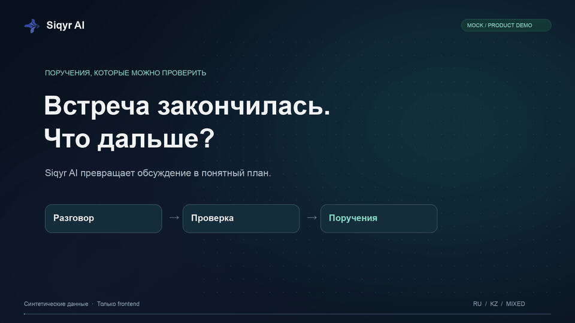
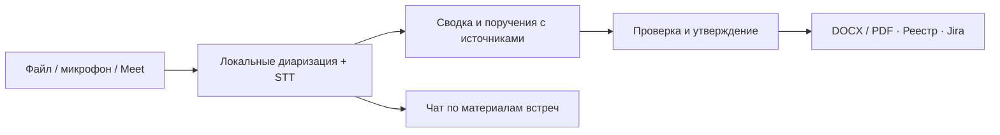

<p align="center">
  
</p>

<h1 align="center">Siqyr AI</h1>
<p align="center"><strong>От встречи — к проверяемым поручениям.</strong></p>

[](artifacts/demo-video/SiqyrAI-highlights.mp4)

<p align="center">
  <a href="artifacts/demo-video/SiqyrAI-highlights.mp4"><strong>▶ Короткое демо · 32 секунды · со звуком</strong></a><br>
  <a href="artifacts/demo-video/SiqyrAI-demo.mp4">Полная демонстрация · 2:27</a> ·
  <a href="Siqyr_AI_Presentation.pptx">Презентация</a><br>
  <sub>Интерфейс продукта на вымышленных mock-данных.</sub>
</p>

<p align="center">Русский · Қазақша · Смешанная речь<br>Собственная STT · Диаризация · Проверка человеком · Протокол и контроль исполнения</p>

<p align="center">
  <a href="#демо">Демо</a> ·
  <a href="#наша-stt-модель">STT</a> ·
  <a href="#диаризация-кто-и-когда-говорил">Диаризация</a> ·
  <a href="#результаты">Результаты</a> ·
  <a href="#быстрый-старт-ноутбук-без-docker">Запуск</a>
</p>

**Siqyr AI помогает секретарю превратить запись совещания в согласованный протокол, а руководителю — видеть, кто, что и к какому сроку должен сделать.** Система распознаёт речь, разделяет реплики по голосам, предлагает сводку и поручения. Секретарь проверяет цитату и аудиоисточник, исправляет спорные поля и утверждает результат.

Проект для кейса **HackAlem AI «Система автопротоколирования совещаний с фиксацией поручений»**. Рабочий профиль рассчитан на развёртывание внутри инфраструктуры заказчика: аудио, STT, диаризация и LLM обрабатываются в заданном контуре.

## Демо

**Короткий обзор — в начале страницы.** Ниже — полная демонстрация пользовательского пути.

### [▶ Смотреть демонстрацию Siqyr AI — 2:27](artifacts/demo-video/SiqyrAI-demo.mp4)

**Запись → голоса и текст → проверка поручений → утверждённый протокол → контроль исполнения.**

[Открыть MP4](artifacts/demo-video/SiqyrAI-demo.mp4) · [Презентация PPTX](Siqyr_AI_Presentation.pptx) · [Папка с видеодемо](artifacts/demo-video/)

В видео показан frontend на заполненных **mock-данных** вымышленного проекта «Самал»: загрузка, говорящие, проверка срока, утверждение, экспорт, поручения, чат и запись разговора. Режим подписан MOCK; обработка и ответы моделируются в браузере. Отдельные результаты реального запуска STT приведены [ниже](#результаты).

## Что получает команда

| Для кого | Польза |
|---|---|
| **Секретарь** | Черновик сводки и поручений, цитаты и переход к записи, ручная правка и утверждение |
| **Руководитель** | Общий реестр: ответственный, срок, статус, просроченные и ближайшие задачи |
| **Исполнитель** | Конкретное поручение с контекстом; после утверждения — задача в Jira по действию секретаря |
| **ИТ-служба** | Локальные модели, явная конфигурация внешних сервисов, разграничение доступа по департаментам |

### Пользовательский путь

1. **Добавить встречу.** Загрузить файл или записать разговор, указать язык, дату и участников.
2. **Получить черновик.** Расшифровка с голосами и таймкодами, сводка, решения и поручения.
3. **Проверить источник.** Прослушать спорную реплику, подтвердить имя, уточнить формулировку или срок.
4. **Утвердить редакцию.** Сохранить проверенный снимок, из которого строятся итоговые документы.
5. **Перейти к исполнению.** Скачать DOCX/PDF, работать с реестром, подключить напоминания и Jira.

## Наша STT-модель

**Распознавание речи — собственная разработка участника команды.** Используется [alibiserikbay/kazakh-russian-mixed-stt](https://huggingface.co/alibiserikbay/kazakh-russian-mixed-stt): модель семейства **wav2vec2 с CTC-декодированием**, предназначенная для русского, казахского и переключения между ними внутри разговора. Модель обучена до хакатона; в проекте она встроена в процесс подготовки и проверки протокола.

| Характеристика | Реализация |
|---|---|
| Рабочий recognizer | Смешанная модель `asr/rukk`; интерфейс принимает `ru`, `kk`, `rukk` |
| Выполнение | TorchScript через `torch.jit.load`, локальный CPU |
| Подготовка аудио | FFmpeg → 16 кГц, mono, float32 |
| Декодирование | Жадный CTC с соответствующим `tokens.lst`, без внешнего STT API |
| Длинные реплики | Разбиение около пауз на фрагменты до 18 секунд |
| Результат | Текст реплики, её начало и конец на исходной записи, метка голоса |
| Лицензия опубликованной STT | Apache-2.0 |

**Модель работает и даёт полезную основу для протокола.** В проверенных записях читаются основные темы и ключевые инструкции, многие числовые показатели и сроки. В отдельном акустическом тесте на Mac **480,3 секунды аудио распознаны за 27,5 секунды** — примерно **в 17,5 раза быстрее длительности записи**.

Этот замер относится только к акустической модели: загрузка весов, декодирование файла, диаризация, LLM и экспорт в него не входят. Имена и специальные термины требуют проверки. Два измеренных аудиопримера преимущественно русскоязычные; отдельная репрезентативная оценка казахской и смешанной речи ещё нужна. [Подробности теста STT](docs/STT_RESULTS.md).

Код: [распознавание](backend/stt/engine.py) · [декодирование и разбиение аудио](backend/stt/audio.py).

## Диаризация: кто и когда говорил

**Локальная pyannote Community-1 выделяет акустические голоса и интервалы их речи.** В текущем пайплайне сначала определяется разметка говорящих, затем соответствующие интервалы поступают в STT. Это позволяет связать текст и поручения с конкретным участком исходной записи.

- **Реплики с таймкодами.** Сохраняются начало и конец речевого интервала; переход из поручения ведёт к исходным секундам аудио.
- **Наложения видны.** Одновременная речь нескольких голосов отмечается `OVERLAP`.
- **Неизвестный голос сохраняется.** Если диаризация недоступна, STT может вернуть текст с `UNKNOWN`, требующим проверки.
- **Имя подтверждает человек.** `SPEAKER_00` — акустическая метка; предложенную связь с именем участника проверяет секретарь. Биометрическая идентификация личности не заявляется.
- **Ответственный может не выступать.** Поручение внешнему юристу или отделу не требует отдельной голосовой метки.

На двух интеграционных записях получены **39 реплик / 4 голоса** и **45 реплик / 5 голосов**, отдельно отмечены наложения. Быстрые смены говорящих иногда сливаются; на первой записи в письменном протоколе указаны пять участников. Число голосов не является метрикой точности диаризации: проверенный DER пока не измерен.

Код: [backend/stt/diarize.py](backend/stt/diarize.py) · [отчёт по интеграционным тестам](docs/handoffs/alibi.md).

## Поручения, которым можно проверить источник

После распознавания LLM формирует **сводку, решения и список действий**. Для поручения сохраняются формулировка, ответственный, дословный срок, вычисленная дата при достаточных основаниях, цитаты и индексы исходных реплик.

| Ситуация | Поведение системы |
|---|---|
| Имя не удалось установить | Исполнитель остаётся неизвестным; возможные кандидаты требуют подтверждения |
| Срок перенесли и согласовали | Сохраняется согласованный срок вместе с источниками изменения |
| В речи противоречивые даты | Сохраняются альтернативы и причина проверки |
| Нет подтверждённой даты встречи | Относительный срок сохраняется текстом, дата не выдумывается |
| Цитата отсутствует в расшифровке | Проверка источника отклоняет неподтверждённую ссылку |
| Секретарь исправляет результат | Правка сохраняется отдельно; raw-транскрипт остаётся неизменным |

Извлечение использует один структурированный вызов LLM с дополнительной попыткой исправить невалидный ответ. Цитаты и сроки проходят программные проверки. После утверждения LLM больше не меняет результат: документы формируются из **неизменяемой утверждённой редакции**. Параллельные правки защищены номером ревизии и ответом `409` при конфликте.

Код: [runner](backend/agents/runner.py) · [проверка цитат](backend/agents/grounding.py) · [сроки](backend/agents/deadlines.py) · [контракт API](docs/CONTRACT.md).

## Возможности продукта

Покрытие обязательного ТЗ: русский STT и основной путь от записи до PDF/DOCX работают; казахская и смешанная речь поддерживаются моделью, но репрезентативный аудиозамер ещё нужен. Диаризация даёт голоса и таймкоды, а связь голоса с человеком подтверждает секретарь. Доступны поручения, саммари, реестр и напоминания. Google Meet поддержан экспериментальным ботом с ручным входом; ботов Teams и Zoom, интеграции с СЭД и голосовой биометрии пока нет. [Матрица требований и доказательств](docs/CRITERIA.md).

| Возможность | Что реализовано |
|---|---|
| **Файл или микрофон** | Загрузка аудио/видео до 100 МБ с проверкой контейнера; браузерная запись WebM-чанками |
| **Серверный review** | Сводка, решения, голоса, поручения, причины проверки, источники, правка и утверждение |
| **DOCX и PDF** | Экспорт утверждённой версии с поддержкой казахских букв; локальные примеры имеют отдельный клиентский экспорт |
| **Реестр поручений** | Ответственные, даты, фильтры, статусы и отметка исполнения; утверждённые поля защищены от произвольной правки |
| **Напоминания** | Проверка сроков и просрочек; на сервере — SMTP/Resend и копия куратору при настройке почты, в локальном UI — напоминания внутри приложения |
| **Чат по встречам** | История диалогов, поиск фрагментов, ответ с источниками; локальные embeddings, reranker и LLM требуют подготовки моделей |
| **Jira** | Явное создание задач после утверждения: срок, цитата, ссылка на аудио и PDF; проверено со сценарной записью |
| **Google Meet** | Отдельный [модуль бота](meet_bot/README.md), уведомление о записи, сохранение аудио и передача в API; вход тестового аккаунта требует ручного участия |
| **Доступ и роли** | Пользователи, департаменты, роли, профиль; backend-адаптеры Keycloak и ЭЦП требуют настройки инфраструктуры заказчика |
| **Ход обработки** | SSE-этапы, состояние проверки и явные режимы `real`, `mock`, `replay`; frontend читает поток с Bearer-авторизацией |

**Чат сохраняет связь с материалами встречи.** API отбирает доступные фрагменты, локальные BGE-M3 embeddings и BGE reranker уточняют релевантность, LLM формирует ответ с ссылками на источники. Индекс и история находятся на сервере; внутренний AI-сервис доступен через Unix socket. Подробнее — [docs/RAG.md](docs/RAG.md). В презентационном видео ответ чата подготовлен заранее и подписан MOCK.

## Архитектура

### Два режима LLM

| Контур | Модель | Данные |
|---|---|---|
| Закрытый рабочий | Локальная `qwen3:4b` через Ollama; `qwen3:1.7b` можно выбрать вручную | Аудио, транскрипт и поручения остаются внутри контура. `LLM_PROVIDER=local`; облачного fallback нет. |
| Закрытый серверный | Qwen 27B на NVIDIA-сервере в инфраструктуре заказчика | API подключается к внутреннему OpenAI-совместимому endpoint через `DOCKER_LLM_BASE_URL` и `LLM_ALLOWED_HOSTS`; данные остаются в разрешённом контуре. Точный артефакт модели и производительность в этом репозитории ещё не зафиксированы. |
| Открытый тестовый | `gpt-6-luna` через OpenAI API | Только полностью вымышленные данные, разрешённые серверным SHA-256 manifest (`LLM_PROVIDER=dev_openai`). Реальные записи сюда не отправляются. |

Режим задаётся в `.env`; контракт и интерфейс одинаковы. Качество моделей различается, см. [результаты](#результаты).



**Frontend:** React + TypeScript, Mantine, TanStack Query, Dexie. **Backend:** FastAPI, SQLModel, SQLite, очередь обработки и SSE. **Аудио:** FFmpeg, PyTorch/TorchScript, pyannote. **LLM:** единый клиент с явным профилем и адресом сервера.

Рабочий аудиопуть: **FFmpeg → диаризация → разбиение речевых интервалов → STT → извлечение → review → экспорт**. VAD-артефакт входит в комплект STT-модели, но текущий `engine.py` не вызывает отдельный ONNX VAD; разбиение использует интервалы диаризации и тихие участки сигнала.

[Архитектура](docs/ARCHITECTURE.md) · [Стек и запуск](docs/STACK.md) · [Журнал решений](docs/DECISIONS.md)

## Результаты

Здесь разделены скорость акустической модели, поведение диаризации и извлечение поручений. Результаты получены на небольших тестовых наборах и не являются общей оценкой точности продукта.

| Проверка | Подтверждённый результат | Граница измерения |
|---|---|---|
| **Скорость STT на Mac** | 480,3 с аудио → 27,5 с акустического inference; RTF ≈ 0,057 | Без загрузки, диаризации и остального пайплайна |
| **Аудио + диаризация** | Два прогона: 39 и 45 реплик, 4 и 5 голосовых меток, отмечены наложения | Есть слияния коротких реплик; DER не измерен |
| **Извлечение v1** | 12/12 валидных ответов, 9/9 ожидаемых поручений по сопоставлению источников, 0 лишних | 12 вымышленных стенограмм; точное совпадение ключевых слов действия 7/9 |
| **Сложные случаи v2** | Строгая проверка 6/12, смысловая 8/12; повтор после исправлений 4/5 | Имена, переносы сроков, наложения, внешние исполнители |
| **Проверки защитной логики** | 25/25 проверок v1 и 2/2 v2 | Парсинг, источники, ошибки ответов и поведение после утверждения |
| **Интеграционный real-smoke** | Отдельный 20-секундный прогон STT/диаризация/LLM через API с утверждением и экспортом | Полный длинный сценарий через UI с реальными моделями ещё не проверен |

Результаты извлечения v1/v2 получены на `gpt-6-luna` в разрешённом synthetic-dev профиле. Исторический локальный `qwen3:4b` после корректировки промпта дал 8/12 валидных ответов и 4/9 ожидаемых поручений: выбор LLM влияет на итоговое качество.

**Качество STT оцениваем по аудио, а не по красивому демо.** Основные темы, инструкции и многие сроки распознаются полезно для черновика. Надёжный WER пока не установлен: приложенные письменные протоколы расходятся с дословной речью. Диагностические 28,75% и 12,35% не представляем как точность распознавания. Для казахской и смешанной речи нужен отдельный вручную проверенный корпус.

Источники: [STT](docs/STT_RESULTS.md) · [интеграционные прогоны](docs/handoffs/alibi.md) · [извлечение v1](eval/results_luna_product.md) · [сложные случаи v2](eval/ai_quality_v2/README.md) · [локальный baseline](eval/results_repeat.md).

## Модели и лицензии

| Компонент | Модель | Где работает |
|---|---|---|
| STT | [alibiserikbay/kazakh-russian-mixed-stt](https://huggingface.co/alibiserikbay/kazakh-russian-mixed-stt) (Apache-2.0): wav2vec2 + CTC, казахский, русский и смешанная речь за один проход, жадное декодирование, 16 кГц. Обучена участником команды до хакатона | CPU, локально |
| VAD-артефакт | `vad.onnx` из репозитория STT; текущий аудиопуть его не вызывает | В комплекте модели |
| Диаризация | [pyannote/speaker-diarization-community-1](https://huggingface.co/pyannote/speaker-diarization-community-1) — gated: нужно принять условия на Hugging Face | CPU, локально |
| LLM, рабочий профиль | Ollama: `qwen3:4b`, резерв `qwen3:1.7b` | loopback |
| LLM, разработка | `gpt-6-luna` через OpenAI API — только на полностью вымышленных стенограммах | внешний API |

После подготовки моделей размеры и SHA-256 весов записываются в локальные `models/stt/manifest.json` и `models/diarization/manifest.json`. Сами веса в git не попадают. Веса STT занимают около 756 МБ.

## Закрытый контур и приватность

- **Аудио остаётся на сервере обработки.** FFmpeg, STT и pyannote выполняются локально; рабочая LLM размещается на loopback или явно разрешённом внутреннем хосте.
- **Назначение LLM задаётся явно.** Пустой или недопустимый адрес блокирует real-путь. Автоматического перехода на облачный провайдер при ошибке нет.
- **Внешний synthetic-dev отделён.** `dev_openai` разрешён для встроенного вымышленного примера либо тестового файла, чей SHA-256 проверен по серверному manifest. Клиентский `synthetic=true` не даёт такого разрешения.
- **Доступ ограничивается департаментом.** Сервер проверяет права на встречи, источники, утверждение и экспорт; секреты хранятся вне Git.
- **Интеграции включаются отдельно.** Для рабочего контура — внутренние Jira Data Center и SMTP. Облачные сервисы допускаются только для разрешённых вымышленных сценариев разработки.
- **Участники уведомляются о записи.** Подтверждение предусмотрено в интерфейсе записи, бот Meet сообщает об этом в чате.

`run_local.sh` отключает телеметрию библиотек и Agents tracing; `--offline` запрещает скачивание моделей и требует локальный LLM endpoint. Развёртывание с переносом образов и моделей описано в [инструкции для закрытого контура](infra/README.md#закрытый-контур-docker-compose). Физический тест полного сценария при отключённой сети ещё не зафиксирован.

## Быстрый старт (ноутбук, без Docker)

Нужно заранее: Python 3.12+, Node.js 22.18+, Git Bash на Windows. Для реальной обработки ещё FFmpeg и [Ollama](https://ollama.com). Сеть нужна только на время установки.

```bash
bash scripts/setup.sh                      # .venv, зависимости по lock, .env из .env.example, npm ci, preflight
```

Если lock не ставится на вашей платформе, повторите с `--no-lock`.

По умолчанию конфигурация включает mock STT и mock-агентов: пайплайн проходит на синтетическом совещании без моделей. Для серверного пространства со входом в `.env` задайте:

```ini
AUTH_MODE=local
JWT_SECRET=<случайная строка от 32 символов>
BOOTSTRAP_ADMIN_USER=admin
BOOTSTRAP_ADMIN_PASSWORD=<пароль от 12 символов>
```

Для отдельного frontend без API можно выбрать «Продолжить локально» на экране входа; в этом режиме данные хранятся в браузере и серверное распознавание не запускается.

Администратор создаётся при первом запуске, после этого удалите bootstrap-пароль из `.env`. Учётки на каждую роль (`test.admin`, `test.secretary`, `test.viewer` и др.) создаёт `python scripts/seed_test_users.py`, он же печатает общий пароль. Подробнее: [docs/AUTH.md](docs/AUTH.md).

```bash
bash scripts/run_local.sh --offline        # API 127.0.0.1:8000 + фронтенд 127.0.0.1:5174, ничего не скачивает
bash scripts/demo_e2e.sh                   # сквозная проверка через API: запуск → правка → утверждение → DOCX + PDF
```

Откройте http://127.0.0.1:5174. `run_local.sh` сначала запускает `scripts/preflight.py` и проверяет, что порты свободны. `--api-only` поднимает только API, `--port` меняет порт. Остановка — Ctrl+C.

На Windows вместо `.venv/bin/...` используйте `.venv/Scripts/...`.

### Реальная обработка на локальных моделях

Один раз, с сетью:

```bash
bash scripts/setup.sh --with-stt           # torch CPU, onnxruntime, pyannote.audio, CLI hf
.venv/bin/hf auth login                    # токен HF не хранится в git; заранее примите условия pyannote на huggingface.co
```

Перед скачиванием весов впишите в `.env` локальные модели: `MODEL_MAIN=qwen3:4b`, `MODEL_FAST=qwen3:1.7b`. Скрипт делает `ollama pull` именно для этих имён.

```bash
bash scripts/setup.sh --download-models    # ollama pull, веса STT и диаризации в models/, manifest с SHA-256
```

Затем в `.env`: `STT_MODE=real`, `AGENT_MODE=real`, `LLM_PROVIDER=local`, `LLM_BASE_URL=http://127.0.0.1:11434/v1`. Запустите `ollama serve` и `bash scripts/run_local.sh --offline`. Своя запись через API:

```bash
bash scripts/demo_e2e.sh --file запись.wav --meeting-date 2026-09-23 --mode real
```

Подготовка моделей выполняется до запуска; рабочий запрос не скачивает веса автоматически. Отсутствие необходимых компонентов отражается проверками готовности и ошибками обработки. `--offline` дополнительно запрещает LLM не на loopback.

### Docker

```bash
cp .env.example .env
docker compose up --build                  # WITH_STT=1 / WITH_RAG=1 в .env — образ с torch, STT и RAG
```

Приложение — http://localhost:5173 (nginx отдаёт фронт и `/api`), API напрямую — http://127.0.0.1:8000/api/health. Развёртывание в закрытом контуре заказчика (локальные STT, LLM в Ollama, RAG-чат, перенос образов без интернета) — [infra/README.md](infra/README.md#закрытый-контур-docker-compose). Основной проверенный путь — локальный запуск без Docker.

## Развёртывание в закрытом контуре

Сначала на машине с интернетом скачайте веса STT, диаризации, RAG и Qwen и соберите образы. Перенесите образы, `models/` и репозиторий на сервер заказчика. На сервере заполните `.env`: `STT_MODE=real`, `AGENT_MODE=real`, `LLM_PROVIDER=local`, `MODEL_MAIN=qwen3:4b`, `MODEL_FAST=qwen3:1.7b`, `WITH_STT=1`, `WITH_RAG=1`, `COMPOSE_PROFILES=llm`, `AUTH_MODE=local` или корпоративный вход. Секреты в Git не добавляйте.

```bash
docker load -i siqyr-images.tar.gz
docker compose up -d --no-build --wait
curl -s http://127.0.0.1:8000/api/health
```

Ожидается `ready: true` и пустой список `problems`. Пользователи открывают адрес web из `PUBLIC_APP_URL`; LLM и база доступны только внутри сети. Полная последовательность подготовки образов, настройки HTTPS и корпоративного входа — в [инструкции по развёртыванию](infra/README.md#закрытый-контур-docker-compose).

Для Qwen 27B на отдельном NVIDIA-сервере укажите внутренний адрес модели в `DOCKER_LLM_BASE_URL` и её хост в `LLM_ALLOWED_HOSTS`; профиль Ollama `llm` тогда не требуется. Проверьте доступность сервера и точный идентификатор загруженной модели перед запуском real-пайплайна.

## Настройка

Все параметры — в [.env.example](.env.example), секретов в нём нет. `.env` не коммитится.

| Переменная | По умолчанию | Смысл |
|---|---|---|
| `STT_MODE`, `AGENT_MODE` | `mock` | `real` — локальные STT и LLM; любой mock-этап помечает результат `source_mode=mock` |
| `DEMO_MODE`, `REPLAY_RUN_ID` | `live` | `replay` — повтор сохранённого прогона, помечен `source_mode=replay` |
| `LLM_PROVIDER` | `local` | `local` — только loopback или хосты из `LLM_ALLOWED_HOSTS`; `dev_openai` — встроенный образец или проверенная вымышленная тестовая запись |
| `DEV_OPENAI_AUDIO_MANIFEST` | пусто | Серверный JSON с SHA-256 разрешённых вымышленных записей; без него загрузки не передаются внешней LLM |
| `LLM_BASE_URL` | пусто | обязателен для `AGENT_MODE=real`; пусто — real-запуск останавливается, облачного fallback нет |
| `MODEL_MAIN`, `MODEL_FAST` | `gpt-6-luna` | для локального профиля задайте явно, например `qwen3:4b` и `qwen3:1.7b` |
| `STT_MODEL_DIR`, `DIARIZATION_MODEL_DIR` | `models/stt`, `models/diarization` | веса; в git только manifest |
| `STT_LANG` | `rukk` | `rukk` — смешанная речь, `kk`, `ru` |
| `DATA_DIR` | `data/runtime` | SQLite, загрузки, экспорт; удалить папку — удалить все данные |
| `MAX_UPLOAD_MB`, `MAX_QUEUE` | `100`, `3` | лимит файла (413) и очереди при одном worker (429) |
| `AUTH_MODE` | `disabled` | `local` — логин и пароль, `keycloak` — только корпоративный токен, `hybrid` — оба; `disabled` — без входа, для API-демо и тестов |
| `JWT_SECRET`, `BOOTSTRAP_ADMIN_*` | пусто | обязательны при входе по паролю |
| `KEYCLOAK_ISSUER`, `KEYCLOAK_AUDIENCE`, `ECP_VERIFY_URL` | пусто | корпоративный вход и ЭЦП, см. [docs/AUTH.md](docs/AUTH.md) |
| `SMTP_*` или `RESEND_API_KEY` | пусто | почта для напоминаний; без неё напоминания видны только в `/api/notifications` |
| `NOTIFY_EMAILS`, `NOTIFY_CC` | пусто | `{"имя из протокола": "email"}` и куратор в копии |
| `REMINDER_INTERVAL_SEC`, `REMIND_DAYS_BEFORE` | `300`, `1` | частота проверки сроков и за сколько дней напоминать |
| `DEMO_TODAY`, `APP_UTC_OFFSET` | пусто, `5` | сдвиг «сегодня» для показа просрочки; часовой пояс Астаны |
| `JIRA_URL`, `JIRA_TOKEN`, `JIRA_PROJECT`, `JIRA_BOARD_ID`, `JIRA_USERS` | пусто | Jira Data Center (PAT); Cloud — только с `JIRA_ALLOW_CLOUD=1` и сценарной записью |
| `PDF_FONT_PATH` | поиск DejaVu Sans / Arial | TTF с буквами ә ғ қ ң ө ұ ү һ і |

Для тестовой загрузки в `dev_openai` укажите путь к локальному JSON с `version: 1` и `files: [{"sha256": "...", "allow_dev_openai": true, "synthetic": true}]`. SHA-256 считается по байтам исходного аудио; список создаёт владелец сервера. Флаг или имя файла, переданные браузером, не разрешают облачную обработку.

Проверить почту: `python -m backend.app.mailer you@example.com`.

## Проверка

```bash
.venv/bin/python -m pytest                 # 180 тестов backend и eval, mock STT и агенты, без сети
npm --prefix frontend run check            # архитектурные границы, типы, тесты, сборка
bash scripts/demo_e2e.sh                   # живой API: SSE-этапы → правка revision → approve → DOCX + PDF
bash scripts/demo_e2e.sh --jira            # то же + задачи Jira (нужны JIRA_* в .env)
```

Зафиксированный прогон `pytest`: 180 passed (2026-09-23, Windows, Python 3.14). Браузерный E2E (Playwright) на mock-режиме подтвердил путь вход → загрузка → сервер → правка → утверждение → DOCX/PDF, история проверок и оставшиеся задачи перечислены в [docs/STATUS.md](docs/STATUS.md).

## Ограничения

- Браузерная проверка UI (загрузка → черновик → правка → утверждение → DOCX/PDF → реестр) выполнена на mock STT/агентах; с реальными моделями через UI не прогонялась. Карточки встреч без серверной обработки по-прежнему хранятся только в браузере.
- Real-путь проверен по частям: STT и извлечение — на двух записях напрямую, через API — 20-секундным прогоном. Полный прогон длинной записи через API и UI ещё не сделан.
- Диаризация сливает быстрые смены говорящих: на записи №1 четыре голоса при пяти людях. Имена и связь голоса с человеком подтверждает секретарь; биометрической идентификации нет.
- Локальная LLM `qwen3:4b` заметно слабее `gpt-6-luna` на том же наборе. Качество зависит от выбранной модели и железа.
- Относительные сроки без подтверждённой даты совещания остаются текстом. Уверенность модели (`confidence`) не калибрована и всегда `null`.
- Бот Meet зависит от разметки Google Meet и требует ручного входа тестового аккаунта. Бота для Teams и Zoom нет.
- Нет интеграции с СЭД. Выдержки ответственным формируются, но по почте не рассылаются — письма уходят только как напоминания о сроках.
- Одна очередь и один worker: прототип для одного ноутбука или сервера, не промышленное развёртывание.

## Структура

```text
backend/app       API: FastAPI + SQLModel + SQLite, SSE, review, экспорт, авторизация, напоминания, Jira
backend/stt       распознавание речи, VAD и диаризация
backend/agents    propose()/execute(), grounding цитат, разбор сроков, промпты, mock-раннер
backend/shared    общий контракт (Pydantic-схемы)
frontend          веб-интерфейс: React 19 + TypeScript + Vite + Mantine + Dexie
meet_bot          бот для Google Meet: Playwright, запись удалённых аудиотреков
scripts           setup, run_local, preflight, demo_e2e, seed_test_users
eval              синтетические наборы, эталоны, сырые ответы моделей и отчёты
tests             pytest для API, авторизации, контракта, почты, Jira
models            manifest весов (сами веса не в git)
data              синтетические демо-данные; runtime/ создаётся при запуске
infra             Dockerfile фронтенда, nginx, заметки по деплою
docs              задача, контракт, архитектура, решения, статус
```

## Документация

| Документ | О чём |
|---|---|
| [docs/CONTRACT.md](docs/CONTRACT.md) | все маршруты API, схемы, коды ошибок, что не реализовано |
| [docs/ARCHITECTURE.md](docs/ARCHITECTURE.md), [docs/STACK.md](docs/STACK.md) | архитектура и выбор технологий |
| [docs/DECISIONS.md](docs/DECISIONS.md) | журнал решений с обоснованием |
| [docs/AUTH.md](docs/AUTH.md) | вход, роли, Keycloak, ЭЦП |
| [docs/DEMO.md](docs/DEMO.md) | сценарий демонстрации |
| [docs/STT_RESULTS.md](docs/STT_RESULTS.md) | скорость STT и границы оценки качества |
| [docs/RAG.md](docs/RAG.md) | чат, источники и подготовка локальных моделей |
| [docs/DATA.md](docs/DATA.md) | данные, их происхождение и ограничения |
| [docs/AI_USAGE.md](docs/AI_USAGE.md) | как команда использовала ИИ-инструменты и API |
| [eval/README.md](eval/README.md) | как устроена и запускается оценка |
| [frontend/README.md](frontend/README.md), [meet_bot/README.md](meet_bot/README.md), [infra/README.md](infra/README.md) | фронтенд, бот, деплой |

## Команда

- Meiirlan — бэкенд, инфраструктура, интеграция
- Nurdaulet — фронтенд, демо
- Alibi — AI: распознавание речи, агенты, eval

Презентационный ролик использует явно обозначенный вымышленный сценарий. Исходные записи, персональные данные, ключи и веса моделей не включаются в документационный пакет.
