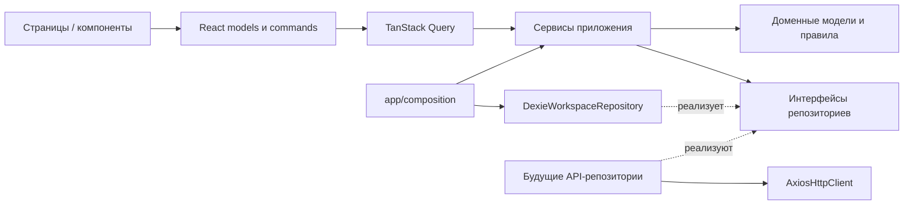

# Архитектура

Проект организован по предметным модулям. Классы используются для поведения и управления ресурсами; React-компоненты и hooks остаются функциональными. Здесь нет общих `BaseService`, контейнера с декораторами или наследования ради одинаковых названий методов.

## Направление зависимостей

- `domain` зависит только от домена и `shared/domain`. Здесь нет React, Axios, Dexie, обращений к DOM или глобальному состоянию.
- `application` организует операции и зависит от доменных правил и интерфейсов. Конкретные адаптеры передаются через конструктор.
- `presentation` содержит JSX, CSS, hooks, формы и Query. UI обращается к внедрённым сервисам; прямые импорты инфраструктуры запрещены.
- `infrastructure` реализует браузерное хранилище, HTTP, микрофон и экспорт.
- `app` выбирает реализации, создаёт зависимости и связывает провайдеры с маршрутизацией.
- `shared` не импортирует предметные модули или приложение.

`npm run check:architecture` проверяет эти границы по AST TypeScript, включая динамические импорты, и обнаруживает циклические runtime-импорты. Type-only зависимости не создают runtime-цикл. Внутри модулей применяются прямые импорты конкретных файлов, без общего barrel, который смешивает домен с UI. Алиас `@/` соответствует `src/`.

## Типы и OOP

`Meeting` и `Task` — сериализуемые снимки. `MeetingRecord` и `TaskRecord` инкапсулируют редактирование, нормализацию и валидацию; экземпляры классов не записываются в IndexedDB. Получение снимка не позволяет менять внутренние данные объекта.

Команды создания и изменения отделены от снимков: `CreateMeetingInput`, `MeetingChanges`, `CreateTaskInput`, `TaskChanges`, `SegmentInput`. Идентификаторы, время создания и происхождение встречи не входят в поля редактирования. Runtime-нормализация также отбрасывает лишние поля. Включены `strict`, `noUncheckedIndexedAccess` и проверки неиспользуемых объявлений.

`MeetingService`, `TaskService`, `SettingsService` принимают интерфейсы репозиториев. Генерация ID и времени передаётся через `Identity`, что делает сценарии воспроизводимыми в тестах. Порты принимают данные и именованные операции, а не callback-транзакции, завязанные на локальную базу.

`TaskBoard` вычисляет группы сроков, фильтры и напоминания. Даты вида `YYYY-MM-DD` разбираются как календарные даты. Прибавление дней не использует фиксированные 24 часа, чтобы границы не сдвигались при переходе на летнее время.

`BrowserRecorder` владеет потоком, обработчиками и таймером. React подписывается через `useSyncExternalStore`. Устаревшие запросы разрешения на микрофон не могут остановить новую запись. При выходе с экрана запись освобождается; оболочка получает активность через типизированный `Recorder`, без событий `window`.

## TanStack Query

`workspace.queries.ts` задаёт ключи и параметры чтения. Все потребители `useWorkspace` используют один кешируемый снимок текущего небольшого локального пространства. `WorkspaceProvider` подключает одну подписку Dexie после успешной загрузки; правки другой вкладки обновляют Query-кеш.

`useMeetingCommands`, `useTaskCommands`, `useSettingsCommands` вызывают сервисы через `useMutation`. После успешной записи `workspace.mutations.ts` отменяет устаревшие чтения и инвалидирует общий ключ. Ошибка мутации остаётся в текущем сценарии и не превращается в ошибку загрузки всего приложения.

Для IndexedDB используется `networkMode: 'always'`: чтение и редактирование работают при отсутствии сети. Для будущих API-репозиториев предусмотрен `networkMode: 'online'`. Локальные данные свежие до инвалидации, сетевые по умолчанию — 30 секунд. Мутации автоматически не повторяются; чтение повторяется до двух раз только при сетевых ошибках или HTTP 5xx.

`AbortSignal` передаётся от Query к `readSnapshot` и далее может передаваться в HTTP. Локальное чтение IndexedDB не прерывает транзакцию физически; Query игнорирует её результат после отмены.

## IndexedDB и совместимость

После добавления авторизации composition создаёт базу `siqyrai-workspace:<encoded principal id>` и отдельный QueryClient для каждого пользователя. Старая `hackalem-workspace` остаётся нетронутой; автоматического переноса её черновиков в аккаунт нет. Базовый `WorkspaceDatabase` сохраняет прежний default для совместимости и тестов. Подробности guards и scope: [frontend-auth.md](frontend-auth.md).

Имя базы `hackalem-workspace`, версия `1`, индексы и формат записей сохранены. Новые настройки не затирают сохранённые значения. Инициализация идемпотентна; после неудачной транзакции возможна повторная попытка.

- Удаление встречи вместе с поручениями атомарно.
- Проверка существования встречи и запись/перенос поручения выполняются в одной транзакции.
- Частичные изменения не перезаписывают чужие поля при параллельном сохранении.
- Добавление реплики читает актуальную расшифровку внутри транзакции.
- Восстановление демонстрационных данных сохраняет локальные встречи, их источники, поручения и настройки.

Контракты `MeetingRepository` и `TaskRepository` требуют сохранения этих гарантий также в будущей серверной реализации. Замену полного списка участников нужно согласовать с серверной стратегией конфликтов, если появится совместное редактирование.

## Подключение бэкенда

1. Согласовать эндпоинты, авторизацию, DTO, правила загрузки медиа и стратегию конфликтов. Не передавать браузерный `Blob` как JSON: для него нужен отдельный upload/`FormData` по серверному контракту.
2. В `modules/<module>/infrastructure` реализовать интерфейсы репозиториев. Сетевые DTO валидировать на границе и преобразовывать в доменные снимки; generic `request<T>` сам по себе runtime-валидацию не делает.
3. Вызвать `createHttpClient()` в composition root. Он требует непустой `VITE_API_BASE_URL` и создаёт `AxiosHttpClient`; в текущем локальном режиме он не вызывается.
4. Передать API-репозитории существующим сервисам. Реализовать `WorkspaceRepository.readSnapshot(signal)` как согласованное чтение нужных ресурсов; `observe` необязателен. Для больших серверных реестров разделить snapshot query на списки/детали с пагинацией и ключами соответствующих модулей.
5. На сервере обеспечить каскадное удаление, проверку связей и конкурентные изменения. Сервисы клиента не заменяют серверную валидацию и авторизацию.

Axios нормализует ошибки в `HttpError` со `status` и `code`, не показывает сырые ответы сервера пользователю, сохраняет отмену запроса и использует таймаут 30 секунд. Токены, refresh и cookies намеренно не реализованы до определения схемы авторизации. В `VITE_*` допускается только публичная конфигурация.

## Проверка

`npm run check` запускает проверку границ, TypeScript для приложения и тестов, тесты Node и production build. Тесты используют `fake-indexeddb` и управляемый адаптер микрофона: они проверяют правила, конкурентные изменения, откат транзакций, повторную инициализацию, сохранение Blob, Query-кеш, работу без сети, отмену HTTP и гонки разрешения на запись. Реальная запись с аппаратного микрофона проверяется отдельно от этих тестов.
